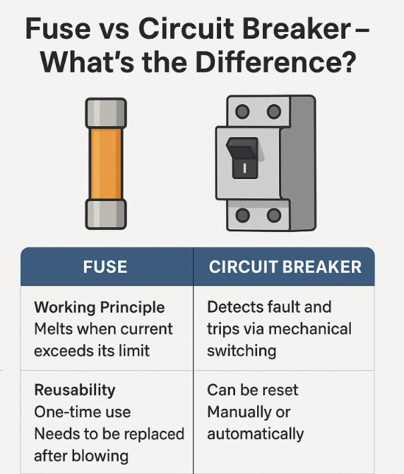
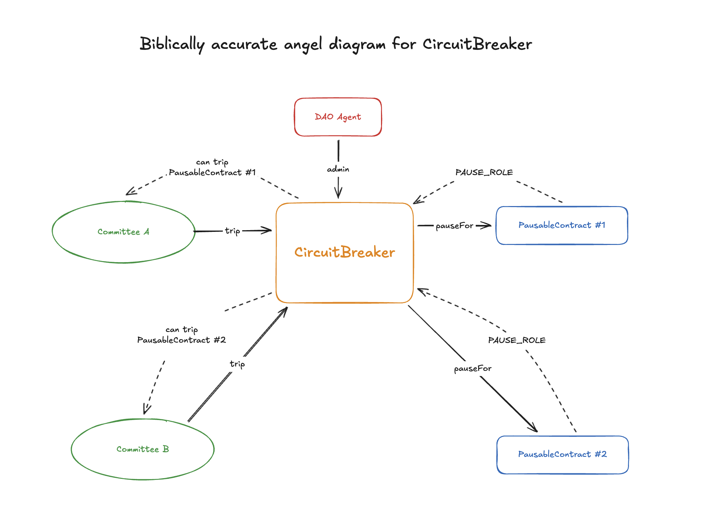

## GateSeals V1

GateSeals were designed as a temporary, disposable emergency brake. A one-time panic button that a committee could smash to immediately pause critical contracts for a limited duration. Each GateSeal was configured at deployment with a fixed set of parameters: the committee, the pause duration, the list of pausable contracts, and an expiry date of up to one year. Once triggered, the GateSeal expired immediately. If never triggered, it expired naturally at the end of its lifetime. Either way, a new GateSeal had to be deployed from scratch.

## The Inconvenience Bomb

The redeployment cycle includes:

- deploying a new GateSeal,
- verifying parameters,
- preparing a snapshot vote (if necessary),
- preparing an on-chain vote revoking the role on the old GateSeal and granting the role to the new one.

This recurring operational burden was intentional and acted as "an inconvenience bomb" designed to push the Lido DAO to come up with a proper long-term solution to emergency pausing.

The bomb went off. The DAO did get tired of the redeployment process. And after three years without a single trigger, the tradeoffs that GateSeal introduces (a committee that can pause specific contracts once, for a bounded duration) proved acceptable given the alternative of having no fast-response capability at all.

## GateSeals V2

GateSeals V2 were designed around committee-driven prolongation, removing the need for repeated DAO votes when nothing has gone wrong. The committee periodically extends the GateSeal's lifetime within designated windows, proving they're alive and responsive without burdening the DAO. GateSeals V2 were never released or deployed. It was a concept that was considered but ultimately abandoned in favor of a fundamentally different approach.

The design carried risks:

- **Misconfiguration-prone.** V2 introduces four new deployment parameters with interlocking constraints that must all be configured correctly. The prolongation windows are fixed and inflexible. If operational needs change, the contract must be redeployed.
- **Redundant liveness proofs.** V2 requires prolongation on every GateSeal individually. A committee managing three GateSeals must send three separate prolongation transactions within their respective windows, even though a single transaction already proves the committee is operational. One proof of liveness is enough; V2 demands one per GateSeal.
- **Fixed prolongation windows.** The prolongation windows are baked into the contract at deployment. If operational needs change, say the committee's signing schedule shifts or the DAO wants to align multiple GateSeals to the same window, the only option is to redeploy.

After exploring the V2 direction thoroughly, the conclusion is that the approach needs to change fundamentally. Instead of patching the GateSeal model with more parameters, the contributors propose a more streamlined unified solution.

## CircuitBreaker

CircuitBreaker is a single, permanent contract that manages all emergency pausing for the protocol. Like an electrical circuit breaker, it trips under fault conditions, protects the system, and is reset by an authorized party. It doesn't self-destruct after tripping.

> A **circuit breaker** is an electrical safety device designed to protect an electrical circuit from damage caused by current in excess of that which the equipment can safely carry (overcurrent). Its basic function is to interrupt current flow to protect equipment and to prevent fire. Unlike a fuse, which interrupts once and then must be replaced, a circuit breaker can be reset (either manually or automatically) to resume normal operation.

In this analogy, a GateSeal works much like a fuse and CircuitBreaker is, well, a circuit breaker for multiple circuits.



### How It Works

A single CircuitBreaker is deployed with the DAO Agent address, pause duration bounds, heartbeat interval bounds, and initial values for both. It is never redeployed. The DAO configures pausers and pausable contracts.

**Pausables and pausers.** The DAO registers pausable contracts by pairing each one with a pauser (committee). That's the entire configuration per contract: one mapping from a pausable contract to the pauser responsible for it. The DAO grants pause permission on each protected contract to the CircuitBreaker's address once. Since the address never changes, this permission does not need to be revoked and regranted.

**Pausable-pauser relationship.** Each pausable contract is assigned exactly one pauser, but a single pauser can be responsible for multiple pausable contracts. This one-to-one relationship from the pausable's side is a deliberate design choice. Allowing multiple pausers per pausable would introduce ambiguity about who is responsible for which contract, complicate accountability when a pause occurs, and expand the attack surface by multiplying the number of parties authorized to pause a given contract. A single pauser per pausable keeps the authorization model simple and auditable. If the DAO needs to transfer responsibility, it reassigns the pausable to a different pauser in a single operation.

**Pause duration.** A single pause duration applies to all pausable contracts. The DAO sets it within bounds configured at deployment. After a pause, the pauser assignment is cleared — the DAO must re-assign the pauser to re-arm the pausable.

**Pausing.** In an emergency, the pauser calls the CircuitBreaker with the contract to pause. The CircuitBreaker verifies the caller is the assigned pauser and that their heartbeat is active. The pauser assignment is then cleared, the contract is paused for the configured duration, and the CircuitBreaker verifies the pause succeeded. Batching multiple pauses can be done externally (e.g. multisig multi-send).

**Heartbeat.** The heartbeat is tied to the pauser, not to individual contracts. A single heartbeat transaction proves the pauser is alive for everything it's responsible for, regardless of how many contracts it covers. This directly addresses V2's redundant prolongation problem: instead of one prolongation per GateSeal, there is one heartbeat per pauser.

The heartbeat gates pausing: a pauser whose heartbeat has expired (exceeds the configured heartbeat interval) cannot pause or refresh their heartbeat. The DAO configures the heartbeat interval within bounds set at deployment. A committee that cannot prove liveness should not be trusted to respond in an emergency. If the DAO determines a pauser is unresponsive, it reassigns the pauser's contracts to a new pauser.

## Comparison

| Problem                              | GateSeal V1                                                                                          | GateSeal V2                                                                                                                                               | CircuitBreaker                                                                                                                                                                                   |
| ------------------------------------ | ---------------------------------------------------------------------------------------------------- | --------------------------------------------------------------------------------------------------------------------------------------------------------- | ------------------------------------------------------------------------------------------------------------------------------------------------------------------------------------------------ |
| **Rotation burden**                  | DAO performs a full redeploy every year                                                              | Committee prolongs within set windows, but each GateSeal requires its own prolongation; windows are inflexible, and parameters are misconfiguration-prone | One heartbeat per pauser confirms liveness. If pauser is not responsive, DAO replaces it with a vote (single vote item). No expiry, no windows, no prolongation parameters |
| **Pause duration limits**            | Hardcoded 4 to 14 day range at deploy time. Change in vote timeline requires blueprint redeployment. | Set at deploy time without limits                                                                                                                         | Single global value within min/max bounds set at deployment. Updatable by admin. Pauser assignment cleared on use; DAO must re-assign to re-arm                                                           |
| **Permission re-grants after use**   | New address every cycle (every year)                                                                 | New address every cycle but the cycle is significantly extended (up to 5 years)                                                                           | Permanent address. Permission granted once per contract, survives all pause cycles. Doesn't need to be regranted                                                                                 |
| **Adding new pausable contracts**    | Deploy new GateSeal and hold a role grant vote                                                       | Deploy new GateSeal and hold a role grant vote                                                                                                            | Hold a vote to add a pauser-contract pair on the existing CircuitBreaker                                                                                                                         |
| **Scaling**                          | One GateSeal per scope, each with its own lifecycle                                                  | Same, plus each GateSeal needs its own prolongation (multiple txs for the same committee on different GateSeals)                                          | All pausers and contracts in one contract. One heartbeat tx per pauser                                                                                                                           |
| **Coverage gaps**                    | Gap between expiry and redeployment                                                                  | Reduced but possible if prolongation window is missed                                                                                                     | No gap between expiration and replacement                                                                                                                                                        |
| **Swapping a dead committee**        | Deploy new GateSeal, re-grant all permissions                                                        | Same problem                                                                                                                                              | Reassign contracts to new pauser address                                                                                                                                                         |
| **Granular use**                     | Subset selection possible but entire GateSeal is expired                                             | Entire GateSeal is expired                                                                                                                                | Per-contract pausing. Pausing one does not affect the ability to pause others                                                                                                                    |
| **Misconfiguration risk**            | Low, 4 simple parameters                                                                             | High, 8 parameters with interlocking constraints                                                                                                          | Low, global duration plus contract-pauser pairs                                                                                                                                            |
| **DG's ResealManager compatibility** | ResealManager has its own permission and pause mechanic. Independent mechanisms  | Same                                                                                                        | Same                                                                                                       |

### Risks and Mitigations

**Single point of failure.** A bug in CircuitBreaker affects all pausers and protected contracts, unlike isolated GateSeals where each has a limited blast radius. Mitigation: the contract is simpler than GateSeal V2 despite doing more, reducing audit surface.

**Broad pause authority.** The CircuitBreaker address holds pause permissions on multiple pausable contracts. Mitigation: the CircuitBreaker can only pause a contract when called by its assigned pauser. The DAO can revoke permission on any contract independently.

**No forced expiry.** A pauser with lost keys retains its assignment until the DAO explicitly reassigns their contracts. Mitigation: a pauser whose heartbeat has expired cannot pause. The DAO can reassign contracts or remove pausers at any time.

### Architecture



### Lifecycle

A walkthrough using two pausers (**Pauser_A** and **Pauser_B**) managing four pausable contracts (**WithdrawalQueue**, **ValidatorExitBus**, **VaultHub**, **PredepositGuarantee**).

```
DEPLOYMENT - dev team
│
│  CircuitBreaker is deployed with:
│    admin              = DAO Agent
│    minPauseDuration   = 4 days
│    maxPauseDuration   = 30 days
│    minHeartbeatInterval = 30 days
│    maxHeartbeatInterval = 365 days
│    pauseDuration      = 14 days
│    heartbeatInterval  = 365 days
│
CONFIGURATION - DAO
│
│  DAO configures the CircuitBreaker in a single vote:
│    assign Pauser_A to WithdrawalQueue
│    assign Pauser_A to ValidatorExitBus
│    assign Pauser_B to VaultHub
│    assign Pauser_B to PredepositGuarantee
│    grant PAUSE_ROLE on WithdrawalQueue to CircuitBreaker
│    grant PAUSE_ROLE on ValidatorExitBus to CircuitBreaker
│    grant PAUSE_ROLE on VaultHub to CircuitBreaker
│    grant PAUSE_ROLE on PredepositGuarantee to CircuitBreaker
│
│  State (pauseDuration = 14 days):
│    WithdrawalQueue      → Pauser_A   ✓ ready
│    ValidatorExitBus     → Pauser_A   ✓ ready
│    VaultHub             → Pauser_B   ✓ ready
│    PredepositGuarantee  → Pauser_B   ✓ ready
│
HEARTBEAT - pausers
│
│  Pauser_A sends a heartbeat for WithdrawalQueue
│  Pauser_B sends a heartbeat for VaultHub
│
│  Latest heartbeat timestamps are recorded in the contract.
│
PAUSE - pauser
│
│  Vulnerability discovered affecting ValidatorExitBus.
│  Pauser_A pauses ValidatorExitBus.
│  ValidatorExitBus is paused for 14 days.
│  Pauser_A assignment is cleared. Heartbeat is updated.
│
│  State (pauseDuration = 14 days):
│    WithdrawalQueue      → Pauser_A   ✓ ready
│    ValidatorExitBus     → (none)     ✗ paused, pauser cleared
│    VaultHub             → Pauser_B   ✓ ready
│    PredepositGuarantee  → Pauser_B   ✓ ready
│
RECONFIGURATION (if needed) - DAO vote
│
│  Any of these, no redeployment required:
│    re-assign Pauser_A to ValidatorExitBus
│    remove pauser from ValidatorExitBus
│    assign Pauser_New to PredepositGuarantee  — replace dead pauser
│    update pause duration to 21 days
│
│  CircuitBreaker address and all existing permissions remain unchanged.
▼
```
